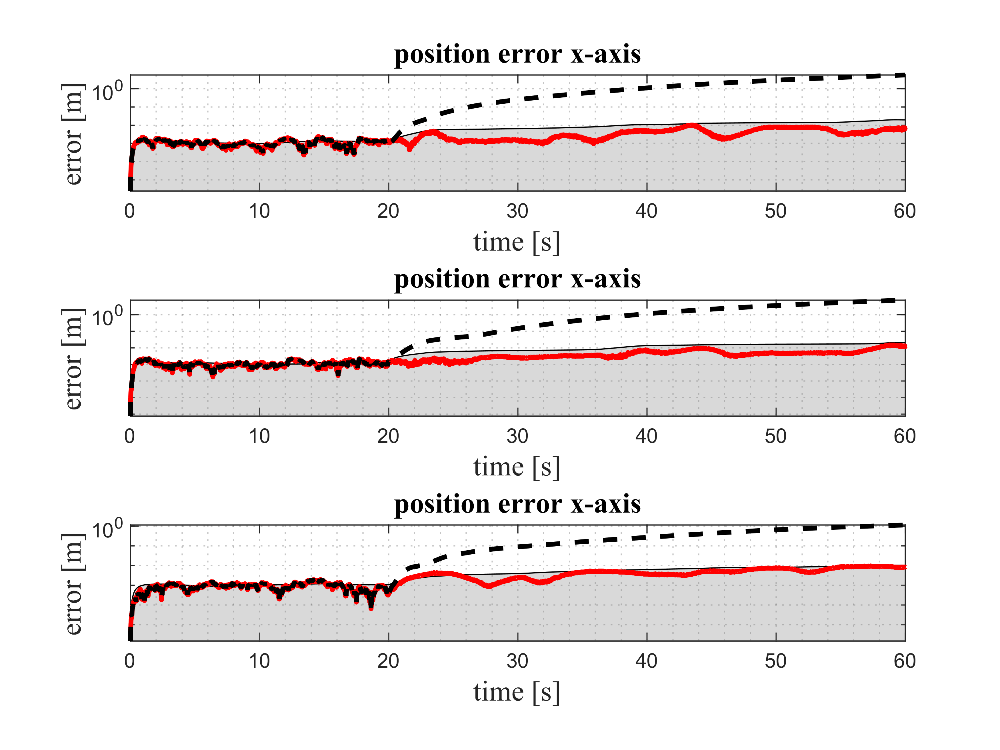

# Magnetic-Field aided Inertial Navigation System

This repo implements a magnetic-Field aided inertial navigation system as in paper [A Tightly-Integrated Magnetic-Field aided Inertial
Navigation System](https://www.google.com/url?sa=t&rct=j&q=&esrc=s&source=web&cd=&cad=rja&uact=8&ved=2ahUKEwji6qLu88LuAhWjFTQIHW85BqMQFjACegQIARAC&url=https%3A%2F%2Fori.ox.ac.uk%2Fmedia%2F5535%2F2018icra_cen.pdf&usg=AOvVaw3V3-M2y-G6erdox6S1aw6j). 

## Comparison with a pure standalone INS
|
|:--:|
| <b>The red line shows the RMSE of the filter estimate, the dashed line shows the RMSE of the filter estimate without magnetic-field aiding.</b>|
## Run simulation
1. create a folder `figures` 
2. run `main.m`

