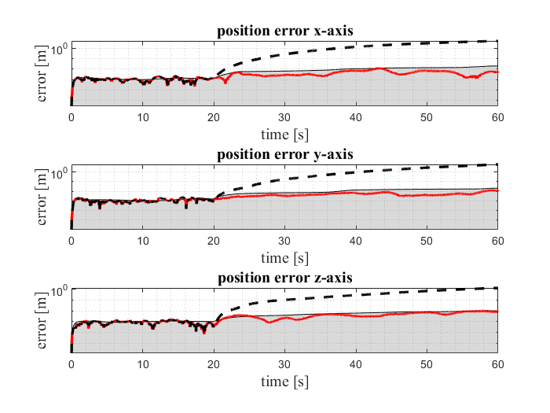

# Magnetic-Field aided Inertial Navigation System

This repo implements a magnetic-Field aided inertial navigation system as in paper [A Tightly-Integrated Magnetic-Field aided Inertial
Navigation System](https://www.researchgate.net/publication/360672526_A_Tightly-Integrated_Magnetic-Field_aided_Inertial_Navigation_System). 

## Comparison with a pure standalone INS
|
|:--:|
| <b>The red line shows the RMSE of the filter estimate, the dashed line shows the RMSE of the filter estimate without magnetic-field aiding.</b>|
## Run simulation
1. create a folder `figures` 
2. run `main.m`

